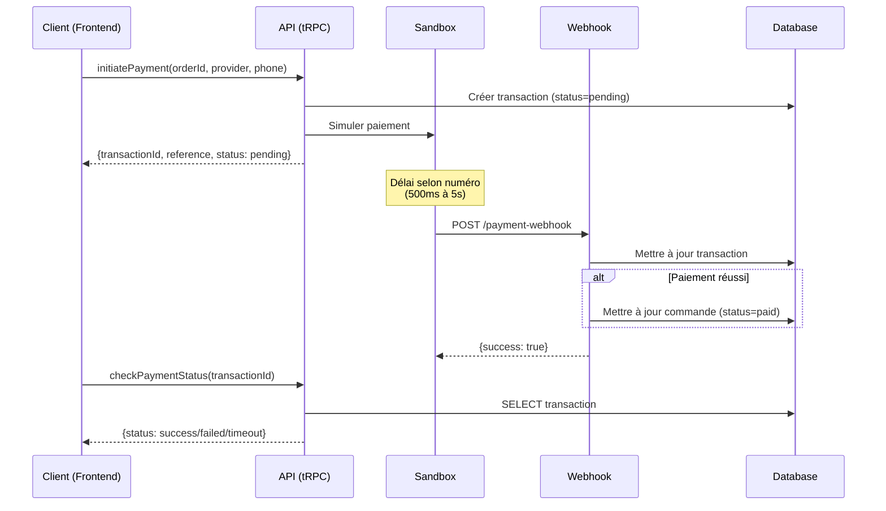

# P1-4: API Paiement Sandbox - Documentation Complète

## Vue d'ensemble

API Sandbox complète pour les paiements Mobile Money, permettant de tester tous les scénarios de paiement sans vraies transactions.

## Configuration

### Variables d'environnement

```env
# Mode de paiement (sandbox ou production)
PAYMENT_MODE=sandbox

# Clé API Chipdeals (production seulement)
CHIPDEALS_API_KEY=your_api_key_here

# URL Supabase pour les webhooks
SUPABASE_URL=https://your-project.supabase.co
```

## Providers supportés

| Provider | Code | Montant Min | Montant Max | Couleur |
|----------|------|-------------|-------------|---------|
| Orange Money | `orange_money` | 100 FCFA | 1,000,000 FCFA | Orange (#FF6600) |
| MTN Mobile Money | `mtn_momo` | 100 FCFA | 1,000,000 FCFA | Jaune (#FFCC00) |
| Moov Money | `moov_money` | 100 FCFA | 500,000 FCFA | Bleu (#0066CC) |
| Wave | `wave` | 50 FCFA | 2,000,000 FCFA | Rose (#FF006E) |

## Scénarios de test (Sandbox)

Le sandbox détermine le comportement du paiement en fonction des **deux derniers chiffres** du numéro de téléphone:

### Scénarios de succès

| Numéro termine par | Résultat | Délai | Exemple |
|--------------------|----------|-------|---------|
| `00` | ✅ Succès immédiat | 500ms | 0707070700 |
| `11` | ✅ Succès après délai | 3s | 0505050511 |
| Autres | ✅ Succès normal | 2s | 0101010123 |

### Scénarios d'échec

| Numéro termine par | Résultat | Délai | Message d'erreur | Exemple |
|--------------------|----------|-------|------------------|---------|
| `99` | ❌ Échec | 1.5s | Solde insuffisant | 0707070799 |
| `98` | ❌ Échec | 1s | Numéro invalide ou compte inexistant | 0505050598 |
| `97` | ❌ Échec | 2s | Transaction refusée par l'utilisateur | 0101010197 |
| `96` | ⏱️ Timeout | 5s | Aucune réponse de l'utilisateur | 0202020296 |
| `95` | ❌ Échec | 1s | Service temporairement indisponible | 0303030395 |

## API Endpoints

### 1. Initier un paiement

**Endpoint**: `payments.initiatePayment` (tRPC)

**Méthode**: `mutation`

**Input**:
```typescript
{
  orderId: number;           // ID de la commande
  provider: Provider;        // orange_money | mtn_momo | moov_money | wave
  phoneNumber: string;       // Format: +225XXXXXXXXXX ou 0XXXXXXXXX
}
```

**Output**:
```typescript
{
  transactionId: number;     // ID de la transaction en DB
  reference: string;         // Référence unique (IFN-{timestamp}-{orderId})
  status: "pending";         // Toujours "pending" à l'initiation
  message: string;           // Message descriptif
  sandbox?: boolean;         // true en mode sandbox
}
```

**Exemple (frontend)**:
```typescript
const { mutate } = trpc.payments.initiatePayment.useMutation();

mutate({
  orderId: 123,
  provider: 'orange_money',
  phoneNumber: '0707070700', // Succès immédiat
});
```

### 2. Vérifier le statut d'un paiement

**Endpoint**: `payments.checkPaymentStatus` (tRPC)

**Méthode**: `query`

**Input**:
```typescript
{
  transactionId: number;     // ID de la transaction
}
```

**Output**:
```typescript
{
  transactionId: number;
  status: PaymentStatus;     // pending | success | failed | timeout
  amount: string;
  provider: string;
  createdAt: Date;
}
```

**Exemple**:
```typescript
const { data } = trpc.payments.checkPaymentStatus.useQuery({
  transactionId: 123,
});

if (data?.status === 'success') {
  console.log('Paiement réussi !');
}
```

### 3. Historique des transactions

**Endpoint**: `payments.getTransactionHistory` (tRPC)

**Méthode**: `query`

**Input**:
```typescript
{
  limit?: number;            // Max 100, défaut: 50
}
```

**Output**:
```typescript
Array<{
  id: number;
  amount: string;
  currency: string;
  provider: string;
  phoneNumber: string;
  status: string;
  reference: string;
  createdAt: Date;
  orderId: number | null;
}>
```

### 4. Rembourser un paiement

**Endpoint**: `payments.refundPayment` (tRPC)

**Méthode**: `mutation`

**Input**:
```typescript
{
  transactionId: number;
  reason?: string;           // Raison du remboursement (optionnel)
}
```

**Output**:
```typescript
{
  success: boolean;
  message: string;
}
```

**Restrictions**:
- Seul le vendeur peut rembourser
- Seules les transactions avec `status='success'` peuvent être remboursées
- Le statut passe à `refunded` après remboursement

### 5. Webhook de confirmation (Public)

**Edge Function**: `payment-webhook`

**URL**: `{SUPABASE_URL}/functions/v1/payment-webhook`

**Méthode**: `POST`

**Headers**:
```
Content-Type: application/json
X-Sandbox-Webhook: true        (en mode sandbox)
X-Provider: orange_money       (provider utilisé)
```

**Payload**:
```typescript
{
  reference: string;           // Référence IFN-*
  status: string;              // success | failed | timeout
  transaction_id: string;      // ID du provider
  amount: string;
  currency: string;
  provider: string;
  phone_number: string;
  timestamp: string;           // ISO 8601
  signature: string;           // HMAC SHA256 (sandbox: simulé)
}
```

**Comportement**:
1. Vérification de la signature (production)
2. Mise à jour de la transaction en DB
3. Si succès: mise à jour de la commande (`status='paid'`)
4. Notification du vendeur (TODO)

**Response**:
```typescript
{
  success: boolean;
  message: string;
  reference: string;
}
```

## Architecture

### Base de données

#### Table `transactions`

| Colonne | Type | Description |
|---------|------|-------------|
| id | serial | ID auto-incrémenté |
| merchant_id | integer | FK vers merchants |
| order_id | integer | FK vers marketplace_orders |
| amount | decimal(10,2) | Montant en FCFA |
| currency | varchar(3) | Devise (XOF) |
| provider | varchar(20) | Provider de paiement |
| phone_number | varchar(20) | Numéro du payeur |
| status | varchar(20) | pending/success/failed/timeout/refunded |
| transaction_id | varchar(255) | ID du provider |
| reference | varchar(255) | Référence unique IFN-* |
| error_message | text | Message d'erreur si échec |
| webhook_data | text | Payload JSON du webhook |
| created_at | timestamp | Date de création |
| updated_at | timestamp | Date de mise à jour |

#### Index

- `transaction_id_idx` sur transaction_id
- `merchant_id_idx` sur merchant_id
- `status_idx` sur status
- `created_at_idx` sur created_at
- `merchant_status_idx` composite sur (merchant_id, status)

### Flux de paiement



## Composants UI

### MobileMoneyPayment.tsx

Composant React complet pour les paiements Mobile Money.

**Props**:
```typescript
interface MobileMoneyPaymentProps {
  open: boolean;                           // État du dialogue
  onClose: () => void;                     // Callback fermeture
  amount: number;                          // Montant en FCFA
  orderId?: number;                        // ID de commande (optionnel)
  onSuccess?: (transactionId: string) => void;  // Callback succès
  onError?: (error: string) => void;       // Callback erreur
}
```

**Étapes du workflow**:
1. **select_provider**: Sélection du provider (Orange, MTN, Moov, Wave)
2. **enter_phone**: Saisie du numéro de téléphone
3. **processing**: Traitement en cours (vérification automatique du statut)
4. **success**: Paiement réussi
5. **error**: Paiement échoué (avec possibilité de réessayer)

**Utilisation**:
```tsx
import MobileMoneyPayment from '@/components/payments/MobileMoneyPayment';

function MyComponent() {
  const [isPaymentOpen, setIsPaymentOpen] = useState(false);

  return (
    <>
      <Button onClick={() => setIsPaymentOpen(true)}>
        Payer avec Mobile Money
      </Button>

      <MobileMoneyPayment
        open={isPaymentOpen}
        onClose={() => setIsPaymentOpen(false)}
        amount={5000}
        orderId={123}
        onSuccess={(txId) => console.log('Paiement OK:', txId)}
        onError={(err) => console.error('Paiement KO:', err)}
      />
    </>
  );
}
```

## Validation

### Numéro de téléphone

Formats acceptés:
- `+225XXXXXXXXXX` (13 caractères)
- `225XXXXXXXXXX` (12 caractères)
- `0XXXXXXXXX` (10 caractères)
- `XXXXXXXXXX` (10 chiffres sans 0)

Tous normalisés vers: `+225XXXXXXXXXX`

### Montant

Validation selon le provider:
- Vérification min/max selon `PaymentSandbox.getProviderInfo()`
- Conversion en string avec 2 décimales pour la DB

## Sécurité

### Mode Sandbox

- ✅ Signature simulée (préfixe `sim_`)
- ✅ Aucune vraie transaction
- ✅ Webhook header `X-Sandbox-Webhook: true`
- ✅ Pas de vraie API externe appelée

### Mode Production

- 🔐 Signature HMAC SHA256 vérifiée
- 🔐 Clé API Chipdeals sécurisée
- 🔐 Webhook authentifié
- 🔐 HTTPS obligatoire

### Protection CSRF

- Headers CORS configurés
- Token d'authentification tRPC
- Vérification merchantId sur chaque requête

## Tests

### Tests unitaires (Vitest)

**Fichier**: `server/routers/payments.test.ts`

**Couverture**:
- ✅ Initier paiement Orange Money (succès)
- ✅ Initier paiement MTN MoMo (succès)
- ✅ Vérifier statut après délai
- ✅ Historique des transactions
- ✅ Validation numéro invalide
- ✅ Remboursement transaction réussie

**Exécution**:
```bash
npm run test -- payments.test.ts
```

### Tests E2E (Playwright)

**Fichier**: `e2e/payment-sandbox.spec.ts`

**Scénarios testés**:
- ✅ Succès immédiat (00)
- ✅ Succès après délai (11)
- ✅ Échec solde insuffisant (99)
- ✅ Échec numéro invalide (98)
- ✅ Échec transaction refusée (97)
- ✅ Validation format téléphone
- ✅ Affichage providers
- ✅ Navigation retour arrière
- ✅ Indicateurs mode sandbox

**Exécution**:
```bash
npm run test:e2e payment-sandbox.spec.ts
```

## Migration vers Production

### Checklist

1. **Obtenir clés API Chipdeals**
   - S'inscrire sur https://chipdeals.me/
   - Obtenir API Key de production
   - Configurer dans `.env`: `CHIPDEALS_API_KEY=xxx`

2. **Changer le mode**
   ```env
   PAYMENT_MODE=production
   ```

3. **Configurer webhook production**
   - URL: `https://your-domain.com/api/trpc/payments.paymentWebhook`
   - Vérifier accessibilité publique
   - Tester avec outil webhook (ex: webhook.site)

4. **Tester en staging**
   - Utiliser les numéros de test Chipdeals
   - Vérifier les webhooks
   - Valider les montants

5. **Activer logging et monitoring**
   - Logger toutes les transactions
   - Alertes sur échecs répétés
   - Dashboard de suivi

6. **Documentation légale**
   - Conditions générales de vente
   - Politique de remboursement
   - Mentions légales Mobile Money

## Dépannage

### Le webhook n'est pas reçu

1. Vérifier l'URL du webhook dans les logs
2. Tester manuellement avec curl:
   ```bash
   curl -X POST https://your-url/functions/v1/payment-webhook \
     -H "Content-Type: application/json" \
     -H "X-Sandbox-Webhook: true" \
     -d '{"reference":"IFN-123","status":"success",...}'
   ```
3. Vérifier les CORS headers
4. Vérifier les credentials Supabase

### Le paiement reste en "pending"

1. Vérifier les logs serveur
2. Vérifier que le webhook est bien appelé
3. Attendre le délai complet (jusqu'à 5s en sandbox)
4. Vérifier le numéro de téléphone (scénario de test)

### Erreur "Database unavailable"

1. Vérifier la connexion à Supabase
2. Vérifier les credentials `.env`
3. Vérifier que les tables existent

## Fichiers créés

### Backend
- ✅ `server/lib/payment-sandbox.ts` - Simulateur complet
- ✅ `server/routers/payments.ts` - Router tRPC mis à jour
- ✅ `supabase/functions/payment-webhook/index.ts` - Edge function webhook

### Frontend
- ✅ `client/src/components/payments/MobileMoneyPayment.tsx` - Composant UI

### Tests
- ✅ `server/routers/payments.test.ts` - Tests unitaires
- ✅ `e2e/payment-sandbox.spec.ts` - Tests E2E (11 scénarios)

### Documentation
- ✅ `P1-4_PAYMENT_SANDBOX_API.md` - Ce document
- ✅ `MOBILE_MONEY_INTEGRATION.md` - Documentation existante

## Support

Pour toute question ou problème:
1. Consulter les logs serveur
2. Vérifier la documentation Chipdeals
3. Tester en mode sandbox d'abord
4. Contacter le support technique

## Conclusion

**P1-4: API Paiement Sandbox - COMPLET** ✅

- ✅ Simulateur sophistiqué avec 8 scénarios
- ✅ Edge function webhook Supabase
- ✅ Tests unitaires et E2E complets
- ✅ Documentation API détaillée
- ✅ Composant UI prêt à l'emploi
- ✅ Migration production documentée

Le système de paiement est maintenant prêt pour les tests en sandbox et la migration vers la production.
